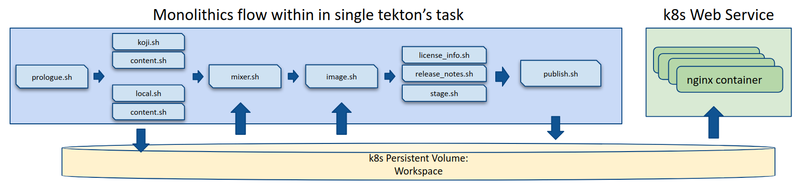

# Host Clear Linux* Downstream on Kubernete & Tekton Pipeline

[clr-distro-factory-tool](https://github.com/clearlinux/clr-distro-factory) is the tool for maintaining downstream, which include several scripts for koji, release, watch pipeline (Note: the pipeline here is not equal the pipeline definition in tekton).

This project is to embed above scripts/tools into a [tekton task](https://github.com/tektoncd/pipeline/blob/master/docs/tasks.md) and execute as a [tekton pipeline](https://github.com/tektoncd/pipeline/blob/master/docs/pipelineruns.md) which can be deployed on any kubernete based cloud native stack.



## Deployment Steps

This project could be deployed on any kubernete platform including local minikube or CSP platforms. Below will use minikube as example

### Setup Minikube cluster
1. [Install minikube](https://kubernetes.io/docs/tasks/tools/install-minikube/)
2. Create or re-launch minikube cluster:
    ```
    minikube start --memory=16384 --cpus=6 \
    --docker-env=HTTP_PROXY=$HTTP_PROXY \
    --docker-env HTTPS_PROXY=$HTTPS_PROXY \
    --docker-env NO_PROXY=$NO_PROXY \
    --disk-size=40g \
    --extra-config=apiserver.enable-admission-plugins="LimitRanger,NamespaceExists,NamespaceLifecycle,ResourceQuota,ServiceAccount,DefaultStorageClass,MutatingAdmissionWebhook"
    ```
    **Note: 16G memory is required for full knative and tekton pipeline.**

3. [Install knative](https://knative.dev/v0.5-docs/install/knative-with-minikube/)
    **Note: 0.6 and 0.7 is not workable till now.**

4. [Install Tekton Pipeline](https://github.com/tektoncd/pipeline/blob/master/docs/install.md)
5. (optional) [Install Tekton CLI tool](https://github.com/tektoncd/cli)

### Setup persistent volume for distro workspace
```
kubectl create -f https://raw.githubusercontent.com/kenplusplus/clr-distro-factory-tekton/master/storage/distro-workspace-pvc-minikube.yaml
```
if want delete persisten volume later:
```
kubectl delete -f https://raw.githubusercontent.com/kenplusplus/clr-distro-factory-tekton/master/storage/distro-workspace-pvc-minikube.yaml
```

### Run release pipeline
```
kubectl apply -f https://raw.githubusercontent.com/kenplusplus/clr-distro-factory-tekton/master/pipeline/pipelinerun-release.yaml
```
You can get logs by
```
tkn pr logs run-release-pipeline -a
```
or use ``` kubectl logs ```

### Publish distro via web interface on kubernetes cluster
After releaase pipeline succesful executed, you can publish distro on kubernete clusters by:

```
kubectl apply -f https://raw.githubusercontent.com/kenplusplus/clr-distro-factory-tekton/master/services/distro-web.yaml
```
Then access web on minikube platform by:
```
minikube service distro-web
```
Or check service information by:
```
kubectl describe service distro-web
```
